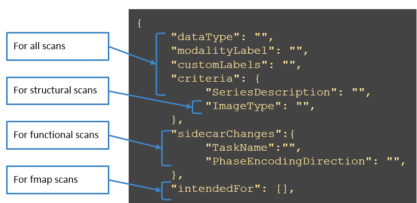

========================
DICOM to BIDs Conversion
========================

*****************
Overview
*****************

clpipe's `convert2bids` commands facilitates the conversion of DICOM (Digital Imaging 
and Communications in Medicine) files into BIDS (Brain Imaging Data Structure) format, 
using either dcm2bids or heudiconv as your underlying converter.

DICOM files are 2D image slices that we receive from the scanner, which can be converted 
into 3D NIfTI files in BIDS format. There is a large amount of data for each scan (one 
file per volume), they contain a lot of metadata that we don't necessarily need, and their 
file names are simply a string of numbers that are not identifiable to a specific scan. 
We can simplify this by converting each scan's DICOMs into a single NIfTI and a descriptive 
json (JavaScript Object Notation) file that contains only the relevant metadata from the 
DICOMs (e.g., task name, temporal resolution, repetition time). 

In short, dcm2bids converts DICOMs to NIfTI and JSON files and then sorts them into BIDS 
format. This simplifies and organizes your neuroimaging data by scan and scan type. Once the 
data is in BIDS format, the data will be sorted by subject, then session (if applicable), 
then data type (e.g., anatomical, functional, fieldmap).

BIDS File Format and Naming Conventions
#################

Each file name contains a chain of `key-value pairs <https://bids-specification.readthedocs.io/en/stable/appendices/entity-table.html>`_ in a specified order, and each key-value 
pair is separated by underscores. For example, the NifTI file for the second run of subject 
065's rest task from their first session may be labelled “sub-065_ses-01_task-rest_run-02” 
once converted to BIDS.

The files you may have after BIDS conversion include:
* Imaging Files: NIfTI
    * It is recommended that these NifTI files are compressed (.nii.gz)
* Tabular files (.tsv)
    * These are csv files where commas are replaced by tabs
    * May be accompanied by a .json data dictionary
* Key/value files (dictionaries): JavaScript Object Notation (.json) files
    * DICOM metadata is extracted into sidecar .json files

Note that BIDS does not like empty, extra, and unformatted files! If you have any scans that
are not included in your conversion configuration file, BIDS conversion may fail.

*****************
Configuration
*****************

**Definitions**

.. autoclass:: clpipe.config.options.Convert2BIDSOptions

The DICOM format string
#################

One important thing to note about using the main command is the need for 
a specifically formatted `dicom_dir_format` option. This is to appropriately map your 
dicom directories to subject/sessions. All subject session folders should be named the 
same way. A dicom_dir_format can contain a {session} and {subject} formatting option.  
Two examples of a dicom_dir_format option are `{subject}_{session}/`, which corresponds 
to the following structure:

.. code-block:: console

    dicom_datadata/
        S01_pre/
            scan1/
            scan2/
            scan3
        S01-post/
            scan1/
            scan2/
            scan3/

Alternatively, you can use `{subject}/{session}/`

.. code-block:: console

    data/
        S01/
            pre/
                scan1/
            post/
                scan1/
        S02/
            pre/
                scan1/
            post/
                scan1/

You can include other text in the formatting option, 
so that the program ignores that text. 
For example, `Subject-{subject}/` used on a dataset with `Subject-01` as a 
folder will determine the subject id to be `01` not `Subject-01`. 
Note that in all examples, there is a trailing forward slash.

dcm2bids configuration
#################

`dcm2bids <https://github.com/UNFmontreal/Dcm2Bids>`_ is a JSON-driven tool for converting DICOM files. 
While not as flexible as heudiconv, dcm2bids is easier to learn and has a
conversion configuration that is simpler to setup and 
modify for users less familiar with programming.

This documentation contains a tutorial for setting up a dcm2bids conversion on the
`Tutorials/BIDS Conversion` page. You can also refer to 
`dcm2bids' tutorial <https://unfmontreal.github.io/Dcm2Bids/3.0.1/tutorial/first-steps>`_ 
for further help.

If using the flywheel_sync command to download your DICOMs, be aware that Flywheel 
creates a DICOM folder structure that is too deep for the default depth setting of 
dcm2niix, which both dcm2bids and heudiconv use to discover DICOM files in your source 
directory. However, dcm2niix can be configured to search deeper with the ``-d`` option.
dcm2bids provides a method of passing options through to dcm2niix by adding a
`dcm2niixOptions` item to your conversion conversion_config.json file. You can visit 
the `Flywheel sync documentation <https://clpipe.readthedocs.io/en/latest/bids_validation.html>`_ for more information.

The Conversion Config File
---------------------

dcm2bids is driven by a JSON configuration file. clpipe helps you out with this by
generating a starter file for you when you use the project_setup command:

.. literalinclude:: ../clpipe/data/defaultConvConfig.json
   :language: json

The starter demonstrates one anatomical and one functional image conversion configuration,
as well one field map, which references the functional image.

The dcm2niix options are included to allow dcm2bids' search depth to be expanded enough
to work with Flywheel's default file structure when syncing. You can ignore it, but
it serves as a useful place to configure any other dcm2niix options you may need
to specify. dcm2niix is the tool used by dcm2bids to perform DICOM to nifti conversion.

dcm2bids_helper
---------------------
To obtain the information from the header, dcm2bids has a handy helper function:

.. code-block:: console

    usage: dcm2bids_helper [-h] -d DICOM_DIR [DICOM_DIR ...] [-o OUTPUT_DIR]

    optional arguments:
        -h, --help            show this help message and exit
        -d DICOM_DIR [DICOM_DIR ...], --dicom_dir DICOM_DIR [DICOM_DIR ...] DICOM files directory
        -o OUTPUT_DIR, --output_dir OUTPUT_DIR
                        Output BIDS directory, Default: current directory

            Documentation at https://github.com/cbedetti/Dcm2Bids

This command will create convert an entire folder's data, 
create a temporary directory containing all the converted files, 
and, more importantly, the sidecar JSONs. These JSONs contain the information needed 
to update the conversion configuration file.

heudiconv configuration
#################

`heudiconv <https://heudiconv.readthedocs.io/en/latest/usage.html>`_ is another tool for converting
DICOM files to BIDS format. This tool is a bit trickier to use than dcm2bids, because
its configuration is driven by a python file instead of json. However, it allows for
more control over conversion than what dcm2bids can provide, allowing you to handle
datasets with more variation or difficult edge cases.

For example, if you have many scans that do not follow your regular naming convention 
(for example, if a number of resting state scans were named “rest” instead of 
“rest-Pre”) or you have multiple unexpected runs of the same task (2 sets of 
anterior-posterior fieldmaps when you only expected one), these are easy to fix using 
heudiconv. In cases like these, you can run BIDS conversion, and then go into the 
.heudiconv folder in your specified BIDS output directory. Find the folder of the 
participant you need to fix (that had some sort of issue with their BIDS conversion), 
then go into their {subject}.edit.txt file and edit it so that the scan that was 
missing is now included (see the dicominfo.tsv file in the same folder to see how you 
should specify the scan name) or delete the extra file that you do not want converted 
to BIDS. Then just rerun BIDS conversion with the overwrite command!

See one of these various `walkthroughs <https://heudiconv.readthedocs.io/en/latest/tutorials.html>`_
for instructions on setting up and using heudiconv.

clpipe does not currently provide a default heuristic file - run heudiconv on
your dataset with the converter set to "None" to generate a `.heuristic` folder,
and copy a heuristic file from one of the subject folders to the root of your clpipe
directory. clpipe comes with heudionv installed as a Python library,
so you should be able to use the `heudiconv` command directly 
on the command line if you're in the same virtual environment where you installed clpipe.

To use heudiconv, provide a heuristic file as your conversion config file:

.. code-block:: json
	
	"DICOMToBIDSOptions": {
		"DICOMDirectory": "...<clpipe_project>/data_DICOMs",
		"BIDSDirectory": "...<clpipe_project>/clpipe/data_BIDS",
		"ConversionConfig": "...<clpipe_project>/heuristic.py",
		"DICOMFormatString": "{subject}",

And when running convert2bids, include the `-heudiconv` flag:

.. code-block:: console

    clpipe convert2bids -heudiconv -c config_file.json

*****************
Command
*****************

.. click:: clpipe.cli:convert2bids_cli
	:prog: clpipe convert2bids

*****************
clpipe convert2bids example
*****************

If you want to convert all the subjects in your DICOM directory, you would use the command
 ``clpipe -config_file clpipe_config.json -submit``. Note that your clpipe conifguration file 
 will contain your study’s input DICOM directory, output BIDS directory, conversion 
 configuration file path, and dicom format string. 

If you want to convert subject 005 specifically, you would use the command ``clpipe 
-config_file clpipe_config.json 005 -submit``.

If any of the information in your configuration file is different than what you want for 
this BIDS conversion, you would use the command options. For example, if you want to 
BIDS convert subject 005 but you want their BIDS data to be in folder 
/proj/hng/study/data_BIDS_temp (which is different from the BIDS data directory you have 
specified in your configuration file), you would use the command ``clpipe -config_file 
clpipe_config.json -BIDS_dir /proj/hng/study/data_BIDS_temp 005 -submit``.

If you need to redo BIDS conversion (for example, if one of scans was not BIDS converted 
correctly), you need to use the overwrite command. For example, you would use the command 
``clpipe -config_file clpipe_config.json -overwrite 005 -submit``.