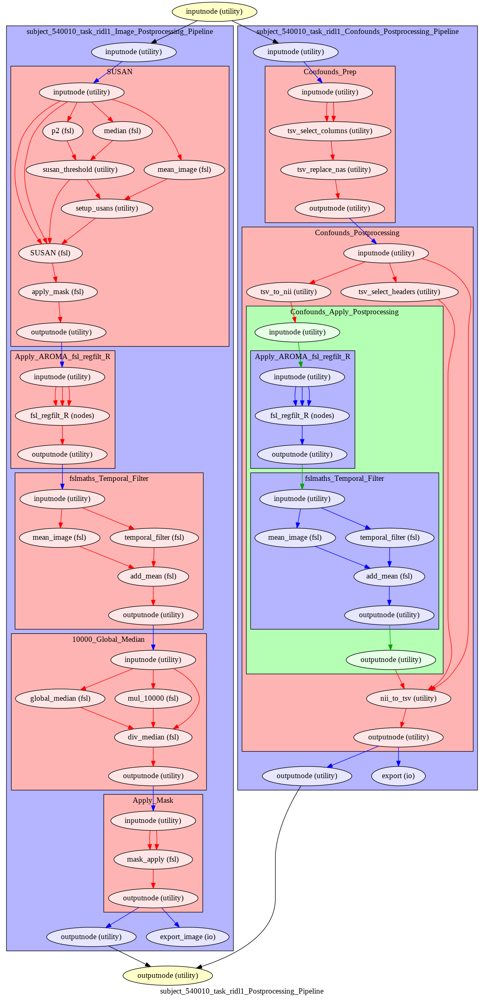
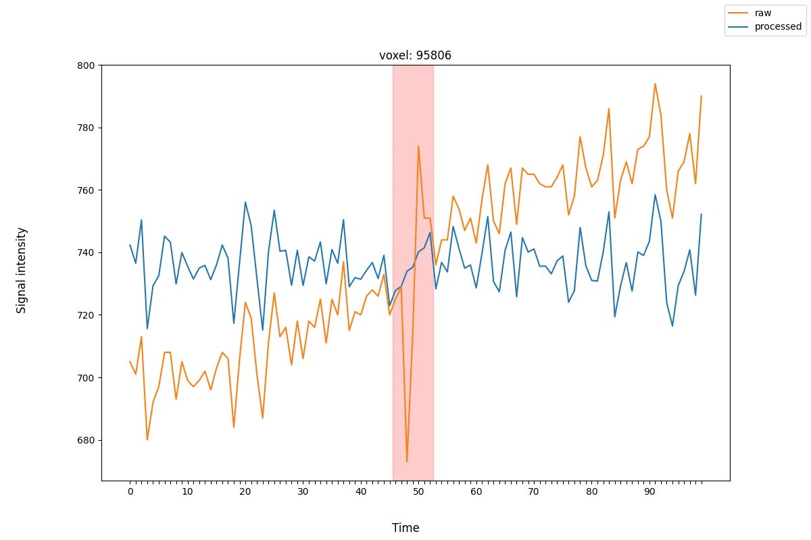
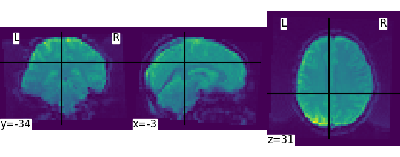

===================
Postprocessing
===================

*****************
Overview
*****************

The ``clpipe postprocess`` command combines the functionality of the
retired ``fmri_postprocess`` and ``glm_setup`` commands into a unified postprocessing stream.

This command allows for flexible creation of processing streams. The order of
processing steps and their specific implementations can be modified in the
configuration file. Any temporally-relevant processing steps can also be
applied to each image's corresponding confounds file.
``postprocess`` caches its processing intermediaries
in a working directory, which allows quick re-runs of pipelines with 
new parameters.

This command will also output a detailed processing graph
for each processing stream.

Available processing steps:

	- **Temporal Filtering**
	- **Intensity Normalization**
	- **Spatial Smoothing**
	- **AROMA Regression**
	- **Confound Regression**
	- **Apply Mask**
	- **Scrub Timepoints**
	- **Resample**
	- **Trim Timepoints**

**Example Pipeline**

******************
Configuration
******************

Overview
#################

The top level of the postprocessing configuration section contains general options like
the path to your working directory, which tasks to target, etc.

Following this are the ``ProcessingSteps``, which define the steps used for
postprocessing. Postprocessing will occur in the order of the list.

``ProcessStepOptions`` displays all of the processing steps with configurable options,
allowing them to be configured to suit the needs of your project. See the Processing
Step Options section for more information about configuring this section.

``ConfoundOptions`` contains settings specific to each image's confounds file, and
``BatchOptions`` contains settings for job submission.

**Option Block**
.. code-block:: json

	"PostProcessingOptions2": {
		"WorkingDirectory": "",
		"WriteProcessGraph": true,
		"TargetImageSpace": "MNI152NLin2009cAsym",
		"TargetTasks": [],
		"TargetAcquisitions": [],
		"ProcessingSteps": [
			"SpatialSmoothing",
			"TemporalFiltering",
			"IntensityNormalization",
			"ApplyMask"
		],
		"ProcessingStepOptions": {
			"TemporalFiltering": {
				"Implementation":"fslmaths",
				"FilteringHighPass": 0.008,
				"FilteringLowPass": -1,
				"FilteringOrder": 2
			}, 
			...additional processing step options
		},
		"ConfoundOptions": {
			"Columns": [
				"csf", "csf_derivative1", "white_matter", "white_matter_derivative1"
			],
			"MotionOutliers": {
				"Include": true,
				"ScrubVar": "framewise_displacement",
				"Threshold": 0.9,
				"ScrubAhead": 0,
				"ScrubBehind": 0,
				"ScrubContiguous": 0
			}
		},
		"BatchOptions": {
			"MemoryUsage": "20000",
			"TimeUsage": "2:0:0",
			"NThreads": "1"
    	}	
	}

**Top-Level Definitions**
.. autoclass:: clpipe.config.project.PostProcessingOptions
	:members:

Processing Step Options
#################

Temporal Filtering
--------------------

This step removes signals from an image's timeseries based on cutoff thresholds. This
transformation is also applied to your confounds.

**ProcessingStepOptions Block:**

.. code-block:: json

	"TemporalFiltering": {
		"Implementation":"fslmaths",
		"FilteringHighPass": 0.008,
		"FilteringLowPass": -1,
		"FilteringOrder": 2
	}

**Definitions:**

.. autoclass:: clpipe.config.project.TemporalFiltering

**Special Case: Filtering with Scrubbed Timepoints**

When the scrubbing step is active at the same time as temporal filtering (see
``ScrubTimepoints``), filtering is handled with a special workflow. This for two
reasons: first, temporal filtering must be done before scrubbing, because this step
cannot tolerate NAs or non-continuous gaps in the timeseries. Second, filtering can
distribute the impact of a disruptive motion artifact throughout a timeseries, despite
scrubbing the offending timepoints aftwards. The solution to this is to interpolate
over the timepoints to be scrubbed when temporal filtering.

The following diagram shows a timeseries with a large motion artifact (blue), with the points
to be scrubbed highlighted in red:

The processed timeseries (orange), after filtering, shows how the scrubbed points
were interpolated to improve the performance of the filter.

*Warning*: To achieve interpolation, this special case always uses the 3dTproject
implementation, regardless of the implementation requested.

Intensity Normalization
--------------------
This step normalizes the central tendency of the data to a standard scale. As data
acquired from different subjects can vary in relative intensity values, this step
is important for accurate group-level statistics.

**ProcessingStepOptions Block**

.. code-block:: json

	"IntensityNormalization": {
		"Implementation": "10000_GlobalMedian"
	}

**Definitions**

.. autoclass:: clpipe.config.project.IntensityNormalization

Spatial Smoothing
--------------------

This step blurs the image data across adjacent voxels. This helps improve the validity
of statistical testing by smoothing over random noise in the data, and enchancing
underlying brain signal.

To achieve the smoothing, a 3D Gaussian filter is applied to the data. This filter takes
as input a kernel radius, which is analogous to the size of the blur tool in a photo
editing tool.

**Unsmoothed Raw Image**

**Smoothed with 6mm Kernel**

.. image:: resources/sample_image_smoothed.png

**ProcessingStepOptions Block**

.. code-block:: json

	"SpatialSmoothing": {
		"Implementation": "SUSAN",
		"FWHM": 6
	}

**Definitions**

.. autoclass:: clpipe.config.project.SpatialSmoothing

AROMA Regression
--------------------

This step removes AROMA-identified noise artifacts from the data with non-aggressive
regression.

AROMA regression relies on the presence of AROMA output artifacts in your fMRIPrep
directory - they are the files with ``desc-MELODIC_mixing.tsv`` and ``AROMAnoiseICs.csv``
as suffixes. Thus, you must have the UseAROMA option enabled in your preprocessing
options to use this step.

Also applies to confounds.

**ProcessingStepOptions Block**

.. code-block:: json

	"AROMARegression": {
		"Implementation": "fsl_regfilt"
	}

**Definitions**

.. autoclass:: clpipe.config.project.AROMARegression

Confound Regression
--------------------
This step regresses the contents of the postprocessesed confounds file out of your data.
Confounds are processed before their respective image, so regressed confounds will
have any selected processing steps applied to them (such as ``TemporalFiltering``) before
this regression occurs. The columns used are those defined in the ``ConfoundOptions``
configuration block.

Confound regression is typically used for network analysis - GLM analysis removes
these confounds through there inclusion in the model as nuisance regressors.

**ProcessingStepOptions Block**

.. code-block:: json

	"ConfoundRegression": {
		"Implementation": "afni_3dTproject"
	}

**Definitions**

.. autoclass:: clpipe.config.project.ConfoundRegression

Scrub Timepoints
--------------------

The ``ScrubTimepoints`` step can be used to remove timepoints from the image timeseries
based on a target variable from that image's confounds file. Timepoints scrubbed
from an image's timeseries are also removed its respective confound file.

**ProcessingStepOptions Block**

.. code-block:: json

    "ScrubTimepoints": {
        "InsertNA": true,
        "Columns": [
            {
                "TargetVariable": "cosine*",
                "Threshold": 100,
                "ScrubAhead": 0,
                "ScrubBehind": 0,
                "ScrubContiguous": 0
            },
            {
                "TargetVariable": "framewise_displacement",
                "Threshold": 0.2,
                "ScrubAhead": 1,
                "ScrubBehind": 0,
                "ScrubContiguous": 0
            }
        ]
    }

**Definitions**

.. autoclass:: clpipe.config.project.ScrubTimepoints

.. autoclass:: clpipe.config.project.ScrubColumn

Resample
--------------------

This step will resample your image into the same resolution as the given ``ReferenceImage``.
Exercise caution with this step - make sure you are not unintentionally resampling
to an image with a lower resolution.

**ProcessingStepOptions Block**

.. code-block:: json

	"Resample": {
		"ReferenceImage": "SET REFERENCE IMAGE"
	}

**Definitions**

.. autoclass:: clpipe.config.project.Resample

Trim Timepoints
--------------------

This step performs simple trimming of timepoints from the beginning and/or end of
your timeseries with no other logic. Also applies to your confounds.

**ProcessingStepOptions Block**

.. code-block:: json

	"TrimTimepoints": {
		"FromEnd": 0,
		"FromBeginning": 0
	}

**Definitions**

.. autoclass:: clpipe.config.project.TrimTimepoints

Apply Mask
--------------------
This step will apply the image's fMRIPrep mask.

Note - There is currently nothing to configure for this step, 
so it is simply added to the ``ProcessingSteps`` list
as "ApplyMask" and does not have a section in ``ProcessingStepOptions``

.. code-block:: json

	"ProcessingSteps": [
		"SpatialSmoothing",
		"TemporalFiltering",
		"IntensityNormalization",
		"ApplyMask"
	]

Confounds Options
#################

This option block defines your settings for processing the confounds file accompanying
each image. A subset of the columns provided by your base fMRIPrep confounds file is
chosen with the ``Columns`` list.

The ``MotionOutliers`` section is used to add spike regressors based on (usually) framewise displacement
for inclusion in a GLM model. Note that this section is independent from the scrubbing
step - the scrubbing step removes timepoints from both the image and the confounds,
while this step adds a variable number of columns to your confounds.

**Definitions**

.. autoclass:: clpipe.config.project.ConfoundOptions

.. autoclass:: clpipe.config.project.ScrubTimepoints

Resample
--------------------
.. autoclass:: clpipe.config.project.Resample

Trim Timepoints
--------------------
.. autoclass:: clpipe.config.project.TrimTimepoints

Batch Options
#################
These options specify the cluster compute options used when submitting jobs. The
default values are usually sufficient to process the data.

**Definitions**

.. autoclass:: clpipe.config.project.BatchOptions

Processing Streams Setup
#################

By default, the output from running fmri_postprocess will appear in your
clpipe folder at ``data_postproc/default``, reflecting the
defaults from PostProcessingOptions.

However, you can utilize the power of processing streams to deploy multiple
postprocessing streams. Options for processing streams are found in a separate section
of your configuration file, ``ProcessingStreams``. 
Each processing stream you define your config file's 
``ProcessingStreams`` block will create a new output folder named 
after the stream setting.

Within each processing stream, you can override any of the settings in the main
``PostProcessingOptions`` section. For example, in the follow json snippet,
the first processing stream will only pick "rest" tasks and defines its
own set of processing steps. The second stream does the same thing, but
specifies a filtering high pass by overriding the default value of -1 with
.009. 

**Option Block**

.. code-block:: json

	...
	"ProcessingStreams": [
		...
		{
			"ProcessingStream": "smooth_aroma-regress_filter-butterworth_normalize",
			"PostProcessingOptions": {
				"TargetTasks": [
					"rest"
				],
				"ProcessingSteps": [
					"SpatialSmoothing",
					"AROMARegression",
					"TemporalFiltering",
					"IntensityNormalization",
					"ApplyMask"
				]
			}
		},
		{
			"ProcessingStream": "smooth_aroma-regress_filter-high-only_normalize",
			"PostProcessingOptions": {
				"TargetTasks": [
					"rest"
				],
				"ProcessingSteps": [
					"SpatialSmoothing",
					"AROMARegression",
					"TemporalFiltering",
					"IntensityNormalization",
					"ApplyMask"
				],
				"ProcessingStepOptions": {
					"TemporalFiltering": {
						"FilteringHighPass": .009
					}
				}
			}
		},
	...

******************
Command
******************

CLI Options
#################

.. click:: clpipe.cli:postprocess_cli
	:prog: clpipe postprocess

Examples
#################

Display jobs to be run without submitting.

.. code-block:: console

	clpipe postprocess -c clpipe_config.json

Submit jobs.

.. code-block:: console

	clpipe postprocess -c clpipe_config.json -submit

Submit jobs for specific subjects.

.. code-block:: console

	clpipe postprocess 123 124 125 -c clpipe_config.json -submit

To run a specific stream, give the ``-processing_stream`` (``-p`` for short) option
the name of the stream:

.. code-block:: console

	clpipe postprocess -c clpipe_config.json -p smooth_aroma-regress_filter-butterworth_normalize -submit